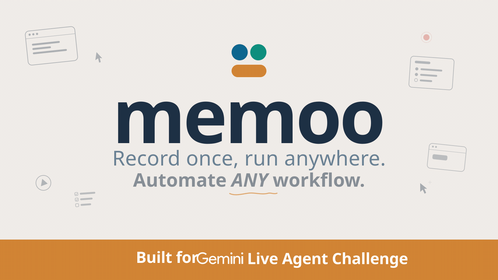

# Memoo



Memoo is a browser workflow recorder and runner for teams that do the same UI work over and over.

The basic idea is simple: someone performs a task once, Memoo watches the screen, listens for voice context, turns that session into a reusable playbook, and then runs that playbook again inside a visible browser with evidence for every step.

This repository was built around the [Gemini Live Agent Challenge](./docs/gemini-live-agent-challenge.md), but the codebase is more than a demo video. It already contains the main product surfaces, a working execution loop, and a Google Cloud deployment path.

## Why Memoo Exists

Most browser automation tools make one of two bets:

- they ask people to write code and selectors by hand
- or they hide the whole thing behind a black box and ask for trust

Memoo takes a different route.

Instead of starting from code, it starts from the work itself. A teammate does the task. The system observes what happened on screen. Voice notes fill in the missing intent. Gemini helps turn that raw capture into a playbook that another teammate can inspect, edit, and run again.

That means Memoo is not trying to replace human judgment with a magical prompt. It is trying to make repetitive browser work teachable, reviewable, and reusable.

## Product Principles

These are the ideas that shape the repo:

- **Start from reality.** We record what happened on screen instead of pretending a plain text prompt contains the whole workflow.
- **Capture intent, not only clicks.** Voice context matters because many UI actions are ambiguous without the reason behind them.
- **Prefer proof over confidence.** Runs produce screenshots and step results so people can verify what happened.
- **Use deterministic automation first.** Playwright handles the obvious path. AI fallback is there for messy pages and broken selectors, not as the default excuse for unreliability.
- **Keep the browser visible.** Watching the run in a live sandbox is often more useful than reading logs after the fact.
- **Make memory a team asset.** A playbook should outlive the person who recorded it.
- **Stay practical.** The stack is opinionated, but the goal is simple: save time on repeated browser work without making the system harder than the work itself.

## What Memoo Does

At a high level, the product loop looks like this:

1. A teammate records a workflow in **Teach Mode**.
2. Memoo sends frames to Gemini to detect meaningful browser actions.
3. **Navigator Live** captures voice context and can ask short clarifying questions.
4. Gemini compiles the raw events into structured playbook steps.
5. A run executes the playbook in either a visible sandbox or a headless browser.
6. The run stores per-step results and screenshot evidence.

That gives you something better than a transcript and more adaptable than a hardcoded script.

## Repository Map

| Path | Purpose |
| --- | --- |
| `apps/web` | Next.js product UI: landing page, onboarding, capture flow, playbooks, runs, automations, vault |
| `apps/api` | FastAPI backend: auth, teams, captures, compile flow, runs, automations, vault, storage |
| `apps/agent` | Stagehand-compatible browser agent service used when deterministic selectors fail |
| `apps/sandbox` | Visible Chromium sandbox exposed through noVNC and CDP |
| `apps/video` | Remotion studio for the Memoo pitch/demo video |
| `infra/terraform/gcp` | Terraform stack for Google Cloud deployment |
| `scripts/gcp` | Build, bootstrap, and deploy helpers |
| `docs/gemini-live-agent-challenge.md` | Build story and challenge submission write-up |
| `docs/project.md` | Product notes, planning, and repo-level project context |

## Main Product Surfaces

### Web app

The frontend lives in `apps/web` and covers the product workflow end to end:

- public landing page
- login and registration
- team workspace dashboard
- capture flow
- playbook library and folders
- run creation and run detail pages
- automations
- vault credentials
- team settings

### API

The backend lives in `apps/api` and exposes the core product behavior:

- `GET /api/health`
- auth and team onboarding
- team dashboard and membership management
- playbook folders, playbooks, and versions
- capture session creation, event ingestion, frame analysis, finalize, and compile
- run creation and run detail retrieval
- automation scheduling and webhook triggers
- vault credential storage
- sandbox status

When the API starts, it also:

- creates database tables if needed
- ensures the evidence bucket exists
- starts the automation scheduler

### Agent service

The agent service in `apps/agent` exposes a small HTTP API:

- `GET /health`
- `POST /execute`

It uses Stagehand with Gemini as the model backend. In practice, this is the escape hatch for steps that are too brittle for normal selector-based execution.

### Sandbox

The sandbox in `apps/sandbox` is a visible Chromium environment with:

- Xvfb + Openbox
- Chromium with remote debugging
- a forwarded CDP endpoint
- x11vnc + noVNC for live viewing
- a tiny health and landing server on port `8585`

This matters because Memoo does not treat execution as an invisible background job. You can actually watch it work.

## Architecture At A Glance

Local development and the GCP deployment follow the same basic split:

- **Web** for the operator-facing interface
- **API** for capture, compile, orchestration, and persistence
- **Agent** for autonomous browser fallback
- **Sandbox** for the visible live browser
- **PostgreSQL** for relational data
- **MinIO or GCS** for evidence assets

On Google Cloud, that becomes:

- `apps/web` on Cloud Run
- `apps/api` on Cloud Run
- `apps/agent` on Cloud Run
- PostgreSQL on Cloud SQL
- evidence storage on Google Cloud Storage
- the visible browser sandbox on a Compute Engine VM
- secrets in Secret Manager
- images in Artifact Registry
- deployment through Cloud Build and Terraform

The dedicated VM for the sandbox is intentional. A live browser session with both noVNC and CDP exposed does not fit neatly into a single serverless container.

## Tech Stack

- **Frontend:** Next.js 16, React 19, Tailwind CSS 4, Framer Motion
- **Backend:** FastAPI, SQLAlchemy, Pydantic, asyncpg
- **Automation:** Playwright, Stagehand
- **AI:** Google Gemini models, including Gemini Live
- **Storage:** PostgreSQL + MinIO locally, GCS in Google Cloud
- **Video:** Remotion
- **Infra:** Docker Compose, Terraform, Cloud Build, Cloud Run, Compute Engine

## Quick Start

There are two reasonable ways to run Memoo:

- **Full Docker stack:** best when you want the whole system working with the fewest surprises
- **Workspace development:** best when you want to edit the web or API app directly on your machine

### Option 1: Full Docker stack

This is the easiest path if you want the product running end to end.

1. Copy the root environment file:

```bash
cp .env.template .env
```

2. Fill in at least:

- `GOOGLE_API_KEY`
- `NEXT_PUBLIC_GEMINI_API_KEY`

3. Start the stack:

```bash
docker compose up -d --build
```

4. Open:

- Web app: `http://localhost:3000`
- API docs: `http://localhost:8000/docs`
- Adminer: `http://localhost:8080`
- MinIO console: `http://localhost:9001`
- Sandbox: `http://localhost:6080/vnc.html?autoconnect=true&resize=scale&reconnect=true&show_dot=false`

Useful commands:

```bash
docker compose logs -f
docker compose down
```

You can also use the `Makefile` shortcuts:

```bash
make up
make logs
make down
```

### Option 2: Workspace development

Use this when you want fast iteration on the web app or API without rebuilding containers each time.

#### Prerequisites

- Node.js 20+
- Python 3.11+
- Docker and Docker Compose
- a Gemini API key

#### 1. Install workspace dependencies

From the repository root:

```bash
npm run setup
```

That installs:

- `apps/web` dependencies
- `apps/video` dependencies
- the Python environment for `apps/api`

#### 2. Install Playwright Chromium for the API

If you are running the API on your host machine instead of in Docker, install the browser once:

```bash
cd apps/api
. .venv/bin/activate
python -m playwright install chromium
```

#### 3. Create app-specific env files

For host-based development, the API and web app do **not** read the root `.env` in the same way Docker Compose does.

Create:

- `apps/api/.env`
- `apps/web/.env.local`

Suggested starting point for `apps/api/.env`:

```env
DB_HOST=localhost
DB_PORT=5432
DB_NAME=memoo
DB_USER=memoo
DB_PASSWORD=memoo
CORS_ORIGINS=http://localhost:3000
STORAGE_BACKEND=minio
STORAGE_BUCKET=memoo-evidence
STORAGE_PUBLIC_URL=http://localhost:9000
MINIO_ENDPOINT=localhost:9000
MINIO_ACCESS_KEY=memoo
MINIO_SECRET_KEY=memoosecret
MINIO_USE_SSL=false
GOOGLE_API_KEY=your_google_api_key
GEMINI_MODEL=gemini-2.5-flash
SANDBOX_CDP_URL=http://localhost:9222
STAGEHAND_SERVICE_URL=http://localhost:8787
```

Suggested starting point for `apps/web/.env.local`:

```env
NEXT_PUBLIC_API_BASE_URL=http://localhost:8000/api
NEXT_PUBLIC_API_PUBLIC_BASE_URL=http://localhost:8000/api
NEXT_PUBLIC_SANDBOX_NOVNC_URL=http://localhost:6080/vnc.html?autoconnect=true&resize=scale&reconnect=true&show_dot=false
NEXT_PUBLIC_GEMINI_API_KEY=your_google_api_key
NEXT_PUBLIC_GEMINI_LIVE_MODEL=gemini-2.5-flash-native-audio-preview-12-2025
```

#### 4. Start infrastructure dependencies

At minimum you need PostgreSQL, MinIO, and the sandbox. If you want autonomous fallback, you also need the agent service.

The most reliable path is still to run the full Docker dependencies:

```bash
docker compose up -d postgres minio minio-init adminer sandbox
```

Then start the agent locally in a separate terminal:

```bash
cd apps/agent
npm install
GOOGLE_API_KEY=your_google_api_key PORT=8787 node --watch server.mjs
```

#### 5. Start the apps

API:

```bash
npm run api:dev
```

Web:

```bash
npm run web:dev
```

Or both at once:

```bash
npm run dev
```

#### 6. Seed demo data

If you want a populated workspace:

```bash
npm run api:seed
```

## Common URLs In Development

- Web app: `http://localhost:3000`
- API base: `http://localhost:8000/api`
- API docs: `http://localhost:8000/docs`
- Sandbox status via API: `http://localhost:8000/api/sandbox/status`
- Sandbox noVNC: `http://localhost:6080/vnc.html?autoconnect=true&resize=scale&reconnect=true&show_dot=false`
- Chromium DevTools endpoint from host: `http://localhost:9222/json/version`
- Adminer: `http://localhost:8080`
- MinIO API: `http://localhost:9000`
- MinIO console: `http://localhost:9001`
- Agent health when run locally: `http://localhost:8787/health`

## NPM Scripts

From the repository root:

```bash
npm run setup
npm run dev
npm run web:dev
npm run web:build
npm run web:lint
npm run video:dev
npm run video:render
npm run api:dev
npm run api:seed
npm run db:up
npm run db:down
```

## Makefile Shortcuts

```bash
make up
make down
make logs
make logs-api
make logs-web
make shell-api
make shell-web
make shell-db
make seed
make clean
make rebuild
```

There are also production-oriented targets such as `make prod-up`, `make prod-down`, and the GCP deployment helpers.

## How The Capture And Run Pipeline Works

### 1. Teach Mode

The capture flow records a live session and stores browser events plus voice context.

Important API endpoints:

- `POST /api/teams/{team_id}/captures`
- `POST /api/captures/{capture_id}/events`
- `POST /api/captures/{capture_id}/analyze-frame`
- `POST /api/captures/{capture_id}/finalize`

### 2. Gemini frame analysis

Frames are sent to Gemini so the system can detect actions grounded in visible UI evidence. The API normalizes the result and filters noisy detections with a minimum confidence threshold.

### 3. Navigator Live

The web app connects to Gemini Live for real-time voice interaction during capture. This is where Memoo can ask short clarifying questions instead of guessing what the user meant.

### 4. Compile to playbook

The compile step turns raw capture events into semantic playbook steps with titles, selectors, variables, and guardrails.

Endpoint:

- `POST /api/captures/{capture_id}/compile`

### 5. Execute

Runs execute through Playwright first. If a step breaks because the selector or page state is messier than expected, the API can delegate the step to the Stagehand-based agent.

Endpoints:

- `POST /api/teams/{team_id}/runs`
- `GET /api/runs/{run_id}`

### 6. Review evidence

Each run stores step-by-step results and screenshots. That is a core part of the product, not an afterthought.

## Storage Model

Memoo uses two kinds of storage:

- **PostgreSQL** for teams, members, captures, playbooks, runs, automations, invites, and vault metadata
- **Object storage** for screenshots and evidence assets

Locally, object storage defaults to MinIO. On Google Cloud, the API can switch to GCS with:

```env
STORAGE_BACKEND=gcs
```

## Automations And Vault

The repo already includes more than ad hoc one-off runs.

### Automations

Automations can be:

- interval-based
- webhook-triggered

Useful endpoints:

- `GET /api/teams/{team_id}/automations`
- `POST /api/teams/{team_id}/automations`
- `PATCH /api/automations/{automation_id}`
- `DELETE /api/automations/{automation_id}`
- `POST /api/automations/{automation_id}/run`
- `POST /api/automations/webhook/{webhook_token}`

The scheduler starts inside the API process at startup and polls for due work.

### Vault

Vault credentials let playbooks and automations reference stored secrets through template keys.

Useful endpoints:

- `GET /api/teams/{team_id}/vault`
- `POST /api/teams/{team_id}/vault`
- `DELETE /api/vault/{credential_id}`

## Video Studio

`apps/video` contains the Remotion project used for branded Memoo demos.

Run it with:

```bash
npm run video:dev
npm run video:render
```

The current composition is `MemooBrandStory`.

## Deployment To Google Cloud

The GCP stack lives in `infra/terraform/gcp`.

### What gets deployed

- web service to Cloud Run
- API service to Cloud Run
- agent service to Cloud Run
- PostgreSQL to Cloud SQL
- evidence storage to Google Cloud Storage
- sandbox to a Compute Engine VM
- secrets to Secret Manager
- images to Artifact Registry

### Quick path

```bash
export PROJECT_ID="your-project"
export REGION="europe-west1"
./scripts/gcp/bootstrap_tf_state.sh
./scripts/gcp/deploy.sh
```

If you prefer Cloud Build:

```bash
gcloud builds submit \
  --config cloudbuild.yaml \
  --substitutions=_REGION=europe-west1,_ZONE=europe-west1-b,_PREFIX=memoo,_GOOGLE_API_KEY=your-key,_NEXT_PUBLIC_GEMINI_API_KEY=your-key
```

Read the full deployment notes in `infra/terraform/gcp/README.md`.

## Troubleshooting

### The web app loads but capture or compile does nothing

Check:

- `GOOGLE_API_KEY` is present for the API
- `NEXT_PUBLIC_GEMINI_API_KEY` is present for the browser Gemini Live session
- the selected Gemini model is enabled on that key

### The sandbox looks offline

Check:

- `docker compose ps`
- `http://localhost:8000/api/sandbox/status`
- `http://localhost:6080/vnc.html?autoconnect=true&resize=scale&reconnect=true&show_dot=false`
- `http://localhost:9222/json/version`
- `docker compose exec sandbox curl -fsS http://localhost:8585/health`

### Runs fail when selectors break

That usually means the agent fallback is unavailable. Check:

- the agent service is running
- `STAGEHAND_SERVICE_URL` points to the right host
- the Google API key is available to the agent too

### Screenshots are missing

Check:

- MinIO is running locally
- the bucket exists
- `STORAGE_PUBLIC_URL` or `MINIO_PUBLIC_URL` points to a reachable address

### Host development is reading the wrong env file

Remember:

- Docker Compose uses the root `.env`
- the FastAPI app reads `apps/api/.env`
- the Next.js app reads `apps/web/.env.local`

## What Is Still Rough

This repo is already useful, but it is still a hackathon-era codebase in a few places.

- database migrations are currently handled by startup-time table creation and a few `ALTER TABLE` safeguards
- some flows are optimized for demo speed rather than long-term product polish
- the cloud stack favors a fast path to deployment over perfect secret hygiene

That is not a warning label so much as a map. The foundations are here. There is still room to harden the edges.

## Demo Checklist

If you are recording a demo, this flow tells the story clearly:

1. Show Teach Mode detecting steps from the live screen.
2. Speak extra context through Navigator Live.
3. Compile the capture into a playbook.
4. Run the playbook in the visible sandbox.
5. Open the run detail page and show screenshot evidence.
6. Mention the Cloud Run, Cloud SQL, GCS, and sandbox VM split.

## Related Docs

- [Blog / challenge write-up](./docs/gemini-live-agent-challenge.md)
- [Project notes](./docs/project.md)
- [API README](./apps/api/README.md)
- [Web README](./apps/web/README.md)
- [Video README](./apps/video/README.md)
- [GCP deployment README](./infra/terraform/gcp/README.md)
