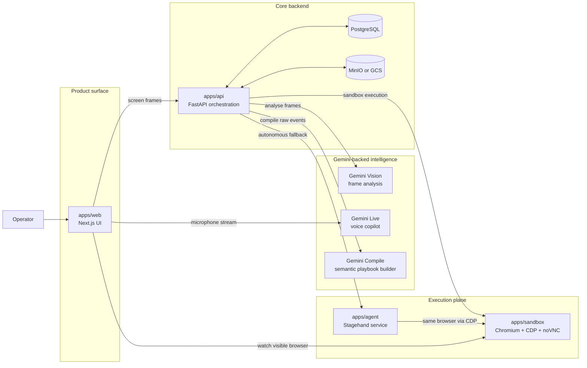
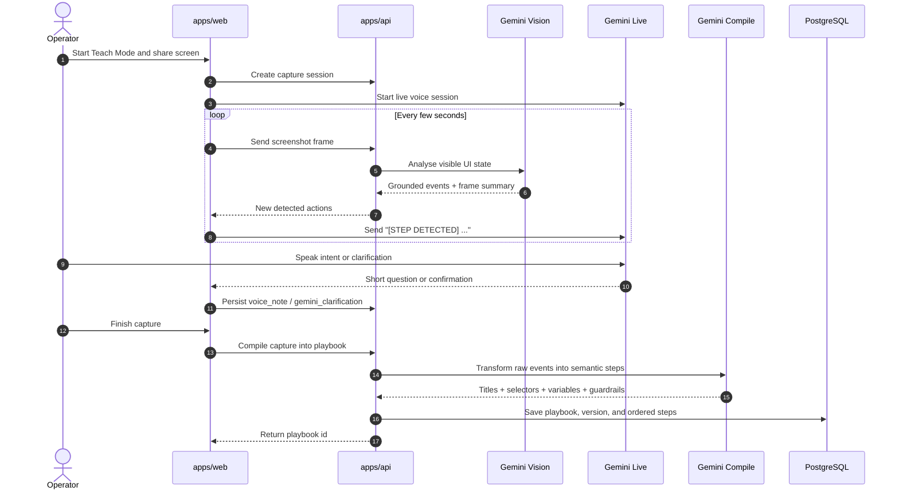
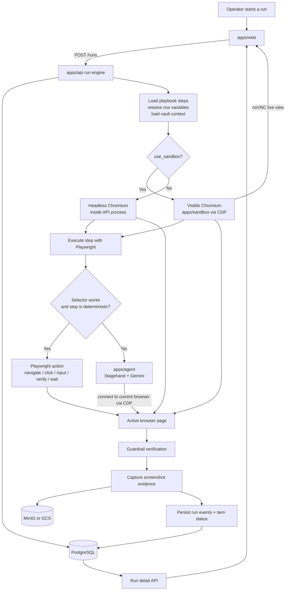
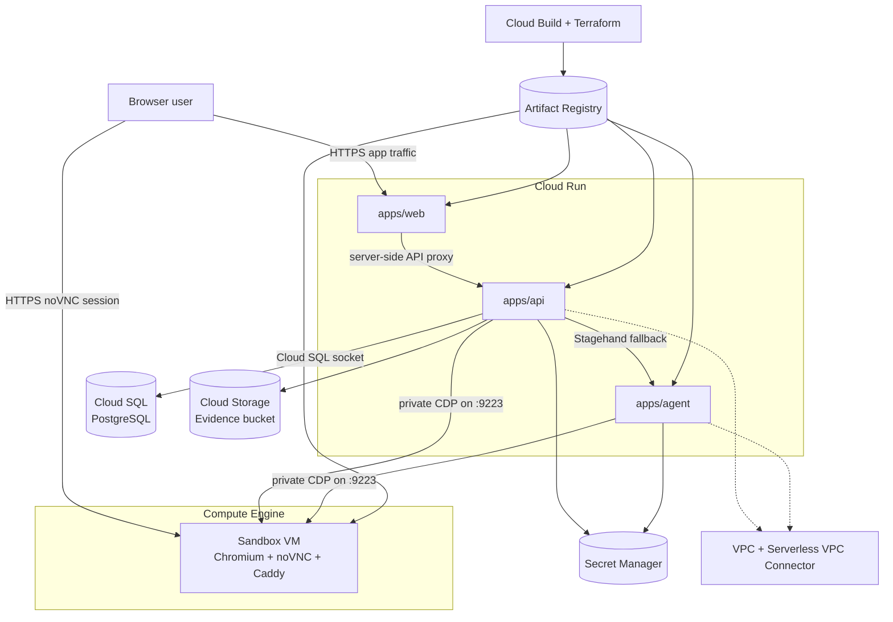

# Memoo Architecture Diagrams

These diagrams are meant to be the quickest way to understand how Memoo is put together without reverse-engineering the codebase from `apps/` and `infra/`.

They intentionally focus on the real runtime boundaries in this repository:

- `apps/web` owns the product UI and operator experience
- `apps/api` owns capture, compile, runs, persistence, and scheduling
- `apps/agent` is the AI fallback for brittle browser steps
- `apps/sandbox` is the visible browser execution plane
- PostgreSQL stores structured product data
- MinIO or GCS stores evidence artifacts

## 1. System Overview

## 2. Teach Mode Capture And Compilation

This is the path from "someone shows the workflow once" to "Memoo saves a reusable playbook".

## 3. Run Execution With Deterministic First, AI Fallback Second

This is the most important operational diagram because it shows Memoo's core reliability strategy: Playwright first, Stagehand only when needed.

## 4. Google Cloud Deployment Topology

This diagram reflects the Terraform split in `infra/terraform/gcp`.

## Reading Notes

- `apps/web` talks to Gemini Live directly from the browser for the voice copilot, while frame analysis and compile go through `apps/api`.
- The visible sandbox is a first-class product surface, not just internal infrastructure.
- The GCP split is deliberate: the sandbox stays on a VM because a live browser with public noVNC and private CDP does not fit neatly into a single serverless service.
- The execution engine is designed around "deterministic first, AI fallback second", which is why the run diagram is split between Playwright and Stagehand instead of routing everything through the agent.
